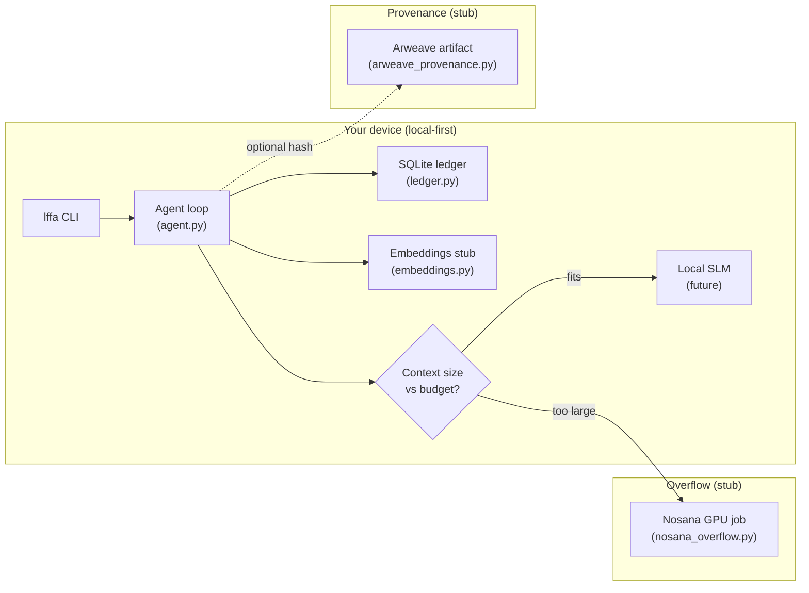

# Architecture — Local-First Financial Agent (hackathon scaffold)

Personal budgeting agent: **data and embeddings stay on-device**; a small local SLM handles routine Q&A; **heavy inference overflows to Nosana** (stub); **optional provenance** to Arweave (stub).

## Diagram

## Data flow

1. **Ingest** — User adds transactions via CLI; rows persist in SQLite under `.lffa/ledger.db` (configurable).
2. **Context build** — Agent reads ledger summary + recent txs; never sends raw DB to cloud in this scaffold.
3. **Embed (stub)** — Deterministic local hash vectors label transactions/questions for future retrieval (not semantic yet).
4. **Route** — `decide_route()` compares prompt size to `LFFA_LOCAL_MAX_CONTEXT_CHARS` (or `LFFA_FORCE_LOCAL`). Under budget → **local SLM path**; over budget → **would overflow to Nosana** (no HTTP in scaffold).
5. **Respond** — Stub text explains which path was chosen; real SLM / Nosana integration is TODO.
6. **Provenance (optional)** — SHA-256 of canonical JSON for a turn; Arweave upload is stubbed.

## What is real vs stub

| Component | Status |
|-----------|--------|
| SQLite ledger + CLI | **Working** |
| Embeddings | **Stub** (deterministic local) |
| Local SLM inference | **Stub** (routing only) |
| Nosana overflow | **Stub** (interface + decision) |
| Arweave upload | **Stub** (hash + metadata) |

## Security / privacy posture (demo)

- No trading, no exchange APIs, no wallet keys in repo.
- `.env` is gitignored; `.env.example` documents future integration keys only.
