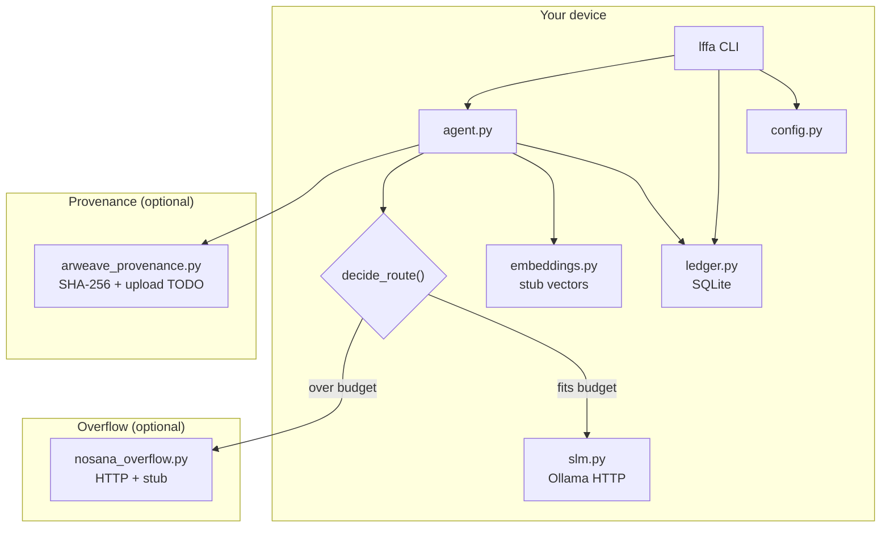

# Architecture

LFFA is a **local-first** personal ledger with an **agent loop** that prefers on-device inference and only marks **Nosana overflow** when context exceeds a configurable character budget (unless `LFFA_FORCE_LOCAL` forces on-device routing).

## System diagram

## Data flow (one `lffa ask` turn)

1. **Load config** — `config.load_config()` reads environment once per CLI invocation (`main()` resets cache).
2. **Build context** — `agent._build_context()` reads `ledger.summarize()` and the last N transactions. No network I/O.
3. **Embed (stub)** — `embeddings.embed_text()` returns deterministic local vectors (labeled non-semantic).
4. **Route** — `nosana_overflow.decide_route(context)` returns `RoutingDecision` with `route`, `reason`, char counts, `force_local`, and `nosana_configured`. Serializable via `to_dict()` for `--json`.
5. **Infer**
   - `local_slm` → `slm.complete_local()` → Ollama `/api/generate` or stub + stderr notice.
   - `nosana_overflow` → `submit_overflow_job()` → balance check or job post when `NOSANA_IPFS_HASH` set; otherwise honest stub/prepared-work payload.
6. **Provenance** — `build_artifact()` hashes canonical JSON; `upload_artifact()` never fabricates a transaction id.

## Routing rules

| Condition | Route |
|-----------|--------|
| `LFFA_FORCE_LOCAL=1` | Always `local_slm` |
| `len(context) <= LFFA_LOCAL_MAX_CONTEXT_CHARS` | `local_slm` |
| Else | `nosana_overflow` |

Overflow **execution** still requires API configuration; without a key the submit path returns `backend=stub`.

## Configuration

All environment access should go through `src/lffa/config.py`:

- `load_config()` — parse env into `LffaConfig`
- `get_config()` — cached instance for runtime modules
- `validate_config()` — non-fatal checks for `lffa doctor`
- `LffaConfig.to_public_dict()` — safe snapshot (masked API key)

Legacy env names (`NOSANA_API_KEY`, `ARWEAVE_GATEWAY_URL`, …) remain supported alongside `LFFA_*`.

## Ledger

- **Schema:** `transactions` with `category`, `notes`, `tags` (comma-separated).
- **Migrations:** `init_db()` adds `tags` column on older DBs via `ALTER TABLE`.
- **Portability:** `export_ledger_json()` / `import_ledger_json()` — versioned JSON envelope (`lffa_export_version`).

## Extension points for contributors

| Goal | Where to start |
|------|----------------|
| Real on-device embeddings | Replace `embeddings.embed_text()`; keep offline default |
| New local SLM backend | Implement `LocalSlmBackend` in `slm.py`; wire from `complete_local()` |
| Richer routing | Extend `decide_route()` (token estimates, embedding size, user flags) |
| Nosana inference reply | After job post, poll job status and parse model output (new module) |
| Arweave upload | Implement signing in `upload_artifact()` (e.g. arweave-lib) |
| Sync / multi-device | New module; keep SQLite as source of truth; do not break export format |

## Security posture (demo scope)

- No exchange APIs, no wallet keys in the repository.
- Secrets only via `.env` (gitignored).
- `lffa doctor` reports whether Nosana key is set using a **masked** prefix, never the full token.
- Agent prompts include ledger excerpts only in memory for the turn; nothing is sent to Ollama except when you run the local SLM path (localhost by default).

## Testing

`pytest` covers ledger export/import, routing, Ollama/Nosana HTTP mocks, Arweave stub behavior, and CLI smoke paths. See [CONTRIBUTING.md](./CONTRIBUTING.md).
